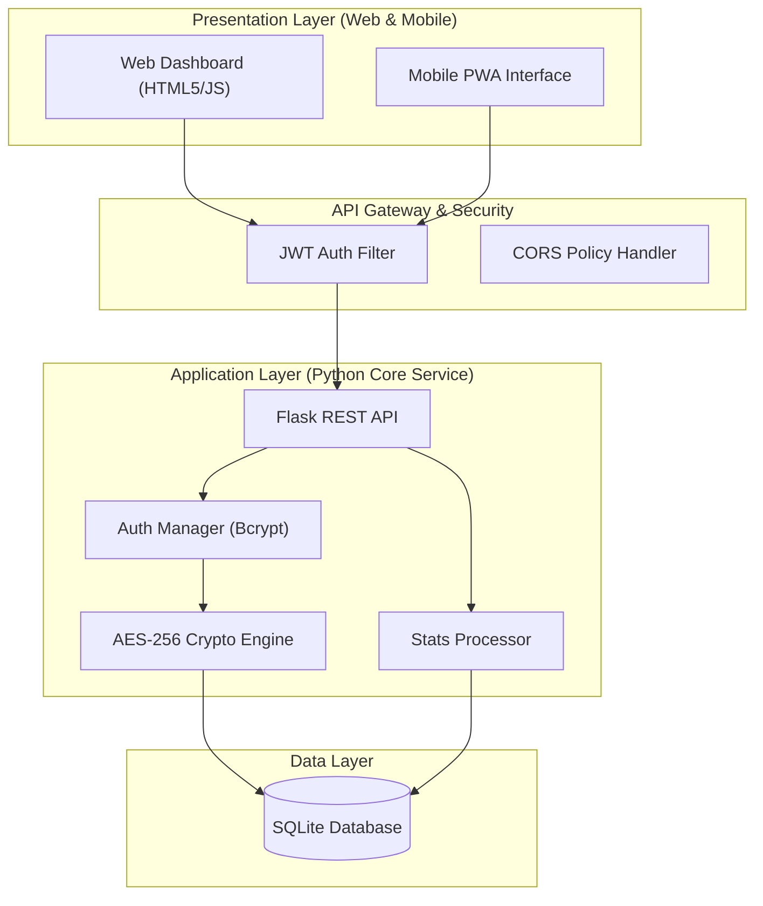

# Integrated System Project Proposal & Design Document

## Project Title
**Flip & Match: The Nilalang Chronicles**  
*A Centralized Horror-Themed Memory Battle System*

## Team Members
[Insert Name/s Here]

## Target Client/Industry
**Entertainment & Education (Philippine Folklore Awareness)**

---

### 1. Executive Summary & Problem Definition

#### The Problem
Many traditional memory games are isolated, client-side only applications that lack data persistence, security, and cross-platform synchronization. Users often lose their progress when switching devices, and game administrators lack a centralized way to analyze user performance or secure sensitive player information against tampering.

#### The Unified Solution
Flip & Match provides a robust, "One-System" ecosystem composed of:
*   **Centralized Python Backend:** A Flask-based core service that handles all business logic, authentication, and data processing.
*   **Shared Cloud Database:** A secured SQLite database (ready for Cloud migration) that centralizes user accounts, game history, and settings.
*   **Web & PWA Accessibility:** A seamless interface that works on desktop and mobile browsers, functioning as a Progressive Web App (PWA) for offline reliability.
*   **Unified API Architecture:** A RESTful gateway ensuring that any future mobile app (Kivy/React Native) consumes the exact same secure data stream as the web dashboard.

---

### 2. System Integration & Architecture (SIA)

#### Architectural Pattern
The system follows a **Monolithic Core with RESTful API Architecture**. This ensures a centralized "Source of Truth" for all data while allowing modular expansion of frontend interfaces.

#### The “One-System” Logic
*   **Shared Backend:** Both Web and future Mobile platforms consume the same Flask API.
*   **Centralized Database:** No local databases are maintained on the client-side; all persistence happens via the Python Core Service.
*   **Seamless Integration:** Authentication (JWT) is shared across all modules, ensuring a single session persists regardless of the interface used.

#### High-Level Architecture Diagram

---

### 3. Technical Implementation (Python Web & Mobile)

#### A. Python Backend (Core Service)
*   **Framework:** Flask (High-performance Python Web Framework)
*   **Major API Endpoints:**
    *   `POST /api/v1/auth/register` - Secure user registration.
    *   `POST /api/v1/auth/login` - JWT-based authentication.
    *   `GET /api/v1/dashboard/stats` - Centralized performance analytics.
    *   `POST /api/v1/history` - Synchronized game result persistence.
    *   `GET /api/v1/stats/global` - Global leaderboards and metrics.

#### B. Mobile & Web Interoperability
*   **Mobile Interface:** Handled via PWA (Progressive Web App) standards, allowing the system to be "Installed" on Android/iOS while consuming the centralized Python API.
*   **Synchronization Strategy:** The system uses **Asynchronous Polling and Real-time State Management** via JavaScript `fetch` and JWT sessions to ensure data consistency across platforms.

---

### 4. Information Assurance & Security Strategy

#### Data Classification
*   **Critical:** User Passwords (Hashed).
*   **Confidential:** User Emails, Game Settings (Encrypted), and Battle History.
*   **Public:** Global High Scores and Stage Metadata.

#### Defense Implementation
*   **Data at Rest:** 
    *   **AES-256 (Fernet) Encryption:** Applied to sensitive `settings` JSON data within the database.
    *   **Bcrypt Hashing:** Passwords are never stored in plain text; they are salted and hashed.
*   **Data in Transit:** 
    *   **TLS 1.3 / HTTPS:** All client-server communication is designed for secure transport layers.
*   **Access Control:** 
    *   **JWT Authentication:** Uses stateless tokens for secure API access, preventing session hijacking.

---

### 5. Reliability & Sustainability Plan

#### Scalability
The system is **Containerized via Docker**, allowing it to be deployed on cloud orchestrators (like Render or AWS) with auto-scaling capabilities to handle traffic spikes.

#### Maintainability
*   **Modular Code:** Logic is separated into `models.py` (Data), `app.py` (Routing), and `auth.py` (Security).
*   **Automated Maintenance:** The `organize_db.py` script provides automated schema migrations and data integrity checks.

#### Disaster Recovery
*   **Cloud Backups:** The system architecture supports automated daily database snapshots.
*   **Failover:** PWA provides offline fallback capabilities, ensuring the game remains playable even during temporary network loss.
